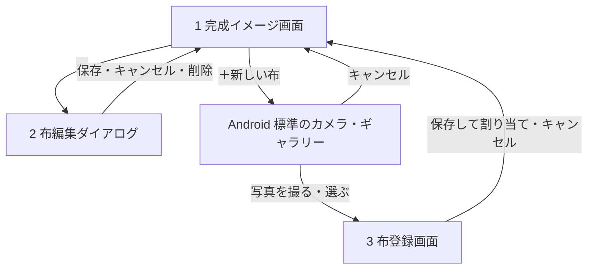

# 情報設計

## 扱う情報

| 情報     | 中身                                         | 保存   |
| -------- | -------------------------------------------- | ------ |
| 布       | 切り抜いた画像、名前、登録日時               | する   |
| 割り当て | 蓋・外側・内側のそれぞれに、どの布を使うか   | しない |
| 表示状態 | 閉めた状態・外した状態・透かした状態のどれか | しない |

次のものは、データとして持たずにアプリに組み込む。

- 箱と蓋の形と寸法
- 柄の大きさ

## 保存する情報

### 布

| 項目     | 内容                                       |
| -------- | ------------------------------------------ |
| 画像     | 正方形に切り抜いた画像だけを保存する       |
| 名前     | 登録日時から自動で付ける（例: 9/14 15:30） |
| 登録日時 | 一覧の並び順に使う                         |

- 元の写真は保存しない
- IndexedDB に保存する（詳しくは [保存先と公開先](hosting.md)）

## 情報どうしの関係

- 蓋・外側・内側の 3 か所は、それぞれ布を 1 枚使うか、未選択のどちらか
- 同じ布を複数か所に使ってよい
- 布を削除すると、その布を使っていた場所は未選択に戻る

## 画面一覧と遷移

| #   | 画面             | 役割                                                        |
| --- | ---------------- | ----------------------------------------------------------- |
| 1   | 完成イメージ画面 | 起動するとこの画面が開く。箱の絵と布の一覧を 1 画面に並べる |
| 2   | 布編集ダイアログ | 名前を変える、削除する                                      |
| 3   | 布登録画面       | 写真から布として使う範囲を切り抜いて保存する                |

写真の撮影と選択は Android 標準の画面を使うため、アプリの画面には含めない。

## 画面ごとの表示と操作

### 1 完成イメージ画面

- 表示
    - 上側
        - 表示状態（閉めた状態・外した状態・透かした状態）
        - 箱の絵
    - 下側
        - どの場所の布を選んでいるか（蓋・外側・内側）
        - 布の一覧（画像と名前、新しい順）
        - 選んでいる場所に今使っている布の印
- 操作
    - 表示状態を切り替える
    - 蓋・外側・内側を切り替える
    - 布をタップして、選んでいる場所に割り当てる
    - 「＋新しい布」で登録を始める
    - 布の「⋯」で布編集ダイアログを開く
- 蓋・外側・内側の切り替えには、割り当てた布の小さな画像を載せる（布の名前は出さない）
- 表示状態の切り替えは箱の上に置く
    - 使う回数が少なく、蓋・外側・内側の切り替えと離すため
- 未選択の場所は、箱の絵では無地のグレー、切り替えでは空の枠で描く
- 起動したときは、蓋を選んでいる状態にする
- 布が 1 枚もないときは「布がまだありません」と「＋新しい布」だけを出す

### 2 布編集ダイアログ

- 表示
    - 布の画像
    - 名前の入力欄
- 操作
    - 名前を保存する
    - キャンセルする
    - 削除する
- 削除ボタンはダイアログの一番下に置き、誤って押しにくくする
- 削除する前に確認する（例: 「9/14 15:30 を削除しますか？使っている場所は未選択に戻ります」）

### 3 布登録画面

- 表示
    - 写真
    - 切り抜く範囲を示す正方形の枠
- 操作
    - 枠を動かす、大きさを変える
    - 保存する
    - キャンセルする
- 名前の入力欄は置かず、登録日時から名前を自動で付ける
- 保存すると、完成イメージ画面で選んでいた場所に割り当てて戻る

## あとで考えること

- 再読み込みしたときに、割り当てを元に戻すか
- 機種変更に備えた、バックアップの書き出しと読み込み
